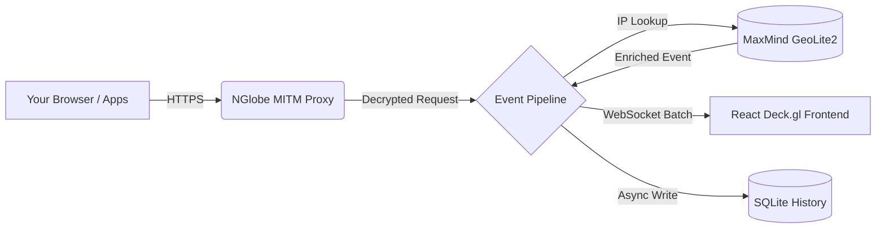

<div align="center">
  

  <h1>NGlobe</h1>
  <p><b>A beautiful, real-time 3D visualization of your machine's network traffic.</b></p>

  <p>
    <a href="https://pypi.org/project/nglobe/"></a>
    <a href="https://pypi.org/project/nglobe/"></a>
    <a href="https://github.com/shashwat/nglobe/blob/main/LICENSE"></a>
  </p>
</div>

<br/>

## The Problem

Tools like Wireshark and Fiddler are incredibly powerful, but they present network traffic as endless, dense rows of text. They lack **spatial context**. When your machine communicates with the outside world, it's hard to intuitively grasp *where* your data is going, *how much* is being sent, and *how fast* the connections are occurring.

## Why NGlobe?

**NGlobe** transforms invisible network packets into a stunning, interactive 3D globe. By intercepting your local traffic and mapping it geographically in real-time, NGlobe gives you a visceral understanding of your machine's digital footprint. 

Watch packets fly across the globe as lasers, instantly see tracking requests routed to remote continents, and monitor your system's global connections—all through a zero-configuration, one-click installation process.

---

## Features

- 🌍 **Interactive 3D Globe**: Built with Deck.gl and MapLibre for buttery-smooth 60fps rendering.
- 🚀 **Real-time Particle System**: Every network request is visualized as a physical particle flying to its destination server.
- ⚡ **Zero-Configuration**: Simply run `nglobe start`. The built-in wizard automatically handles certificates, proxy settings, and GeoIP databases.
- 🔍 **Live Traffic Interception**: Powered by `mitmproxy` to capture both HTTP and decrypted HTTPS traffic.
- 📊 **Rich Analytics**: View exact IPs, autonomous systems (ASN), hostnames, and transfer volumes in a sleek sidebar.

## Architecture



## Technology Stack

- **Backend**: Python 3.11+, FastAPI, Mitmproxy, SQLite (SQLModel)
- **Frontend**: React, TypeScript, TailwindCSS, Zustand
- **Visualization**: Deck.gl, MapLibre GL JS, Framer Motion

---

## Installation & Quick Start

NGlobe is available as a standard Python package.

```bash
pip install nglobe
```

To launch the application:

```bash
nglobe start
```

### First-Run Setup

Upon your first launch, NGlobe will open a beautiful interactive wizard in your browser (`http://localhost:8000`) that will:
1. **Install the CA Certificate**: Required to intercept HTTPS traffic. You will be prompted by Windows UAC to allow the installation.
2. **Download GeoLite2 Databases**: Enter your free [MaxMind Account ID and License Key](https://dev.maxmind.com/geoip/geolite2-free-geolocation-data), and NGlobe will automatically download and configure the IP mapping databases.

That's it! NGlobe will automatically configure your system proxy and start visualizing your traffic.

---

## Roadmap

- [ ] Support for macOS and Linux proxy auto-configuration.
- [ ] Protocol filtering (e.g., only show REST API calls).
- [ ] Historical playback mode (scrub through past traffic).
- [ ] Custom particle colors based on payload size or HTTP status code.

## Performance

NGlobe is engineered for extreme throughput. The backend utilizes asynchronous pipelines and SQLite batching, while the frontend employs a WebSocket event buffer that batches state updates. This allows NGlobe to render hundreds of concurrent connections per second without lagging the browser.

## Contributing

We welcome contributions! Please see our [Contributing Guide](CONTRIBUTING.md) for details on how to set up the development environment, build the frontend, and submit Pull Requests.

## FAQ

**Q: Does NGlobe send my data anywhere?**  
A: **No.** NGlobe is entirely local. The proxy runs on `127.0.0.1`, the SQLite database is stored in your `~/.nglobe` folder, and the frontend is served locally. MaxMind databases are downloaded directly to your machine for offline IP resolution.

**Q: Why do I need to install a certificate?**  
A: To see the full URL and payload of HTTPS traffic, NGlobe acts as a Man-In-The-Middle (MITM) proxy. Without the certificate, NGlobe would only see the destination IP address, but not the domain or specific path.

## License

This project is licensed under the MIT License - see the [LICENSE](LICENSE) file for details.
